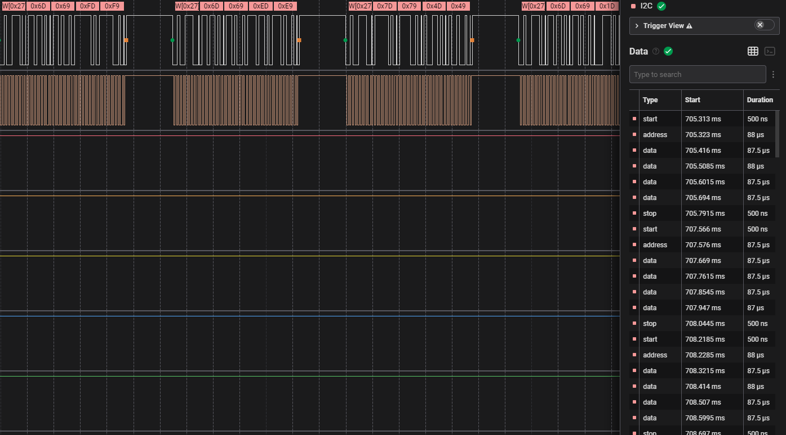
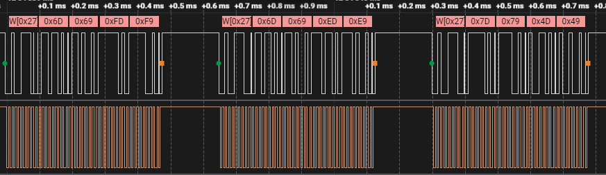
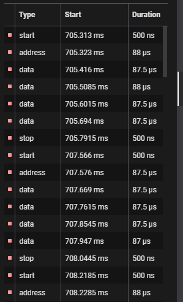
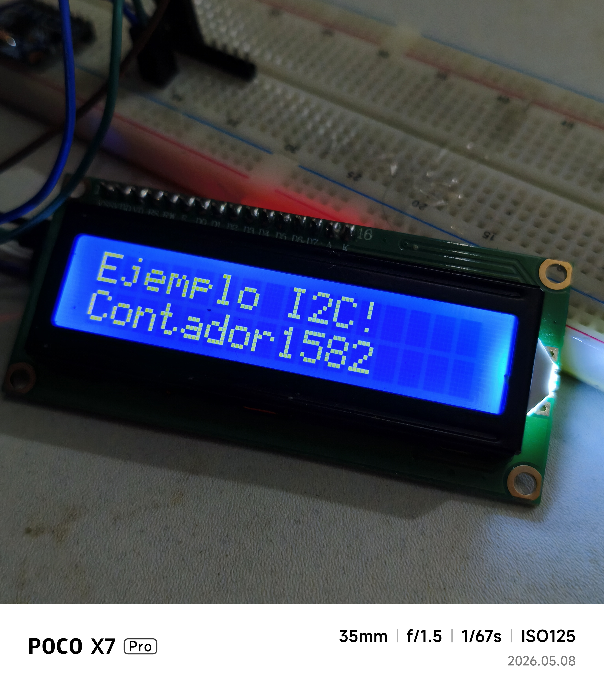

# Proyecto con pantalla LCD1602 I2C
En este ejemplo me comunico con un lcd 1602 con direccion 0x27. La velocidad es de 100khz. Las definiciones relevantes estan en esta funcion.
```c
void i2c_master_init()
{
    i2c_config_t conf = {
        .mode = I2C_MODE_MASTER,
        .sda_io_num = I2C_MASTER_SDA_IO,
        .sda_pullup_en = GPIO_PULLUP_ENABLE,
        .scl_io_num = I2C_MASTER_SCL_IO,
        .scl_pullup_en = GPIO_PULLUP_ENABLE,
        .master.clk_speed = I2C_MASTER_FREQ_HZ,
    };
    ESP_ERROR_CHECK(i2c_param_config(I2C_MASTER_NUM, &conf));
    ESP_ERROR_CHECK(i2c_driver_install(I2C_MASTER_NUM, conf.mode, 0, 0, 0));
}

```


### Analizador logico



### Tramas de datos 



### Secuencias


### Pantalla

